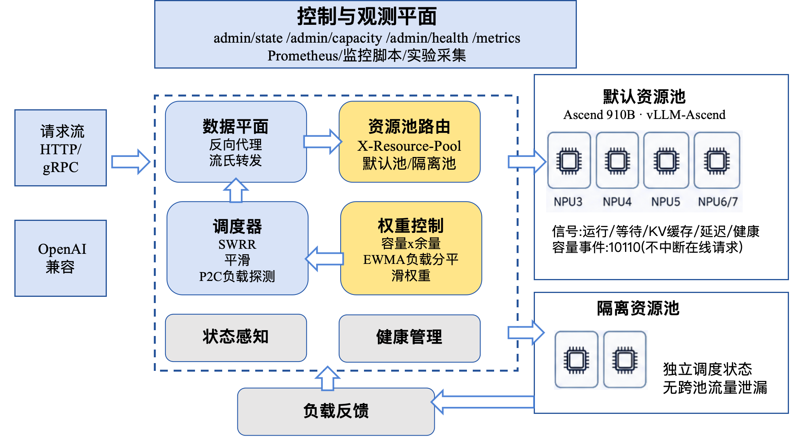

# MUTT：面向昇腾 NPU 推理集群的多信号闭环动态权重调度方案

> **队伍**：ClaudeCode
>
> **成员**：颜明宇，祝境远，张家文，易家权

## 目录

- [摘要](#摘要)
- [1. 赛题理解与设计目标](#1-赛题理解与设计目标)
- [2. 技术路线](#2-技术路线)
- [3. 总体架构](#3-总体架构)
- [4. 核心算法设计](#4-核心算法设计)
- [5. 创新点](#5-创新点)
- [6. 算力网特性利用](#6-算力网特性利用)
- [7. 正式实验环境](#7-正式实验环境)
- [8. 实验结论总览](#8-实验结论总览)
- [9. 核心实验结果](#9-核心实验结果)
- [10. 复现与交付材料](#10-复现与交付材料)
- [11. 边界与后续演进](#11-边界与后续演进)

## 摘要

MUTT（Multi-signal Unified Traffic Tuner，多信号统一流量调优器）面向赛题 2「大模型推理算力资源动态负载感知调度」，实现了一个部署在客户端与 vLLM-Ascend 后端之间的 OpenAI-compatible Go 推理网关。系统以真实 Ascend 910B NPU 集群为验证对象，将资源池隔离、实时负载感知、平滑加权调度、P2C 热点规避、故障摘除和恢复 slow-start 统一到同一个闭环控制框架中。

针对赛题中“capacity 从 10 降至 1 时避免已分配请求被强制中断”的要求，MUTT 不直接硬切流量，而是通过 `desired_weight` 与 `effective_weight` 的缓动机制逐步改变新请求命中概率；已经转发到后端的请求继续自然完成。真实 NPU 实验显示，在 5 个后端中将 NPU3 capacity 从 10 降到 1 后，稳定流量占比为 2.37%，接近理论值 2.44%，全程 29,748 请求 0 错误。

## 1. 赛题理解与设计目标

大模型推理集群的后端可用能力并非静态常量。即使每个实例初始 capacity 相同，实际服务能力也会被以下因素持续扰动：

- 推理实例健康状态和容器重启；
- vLLM engine 中 running / waiting 请求数量；
- KV cache / GPU cache 接近满载导致的排队和尾延迟恶化；
- 外部流量或其他业务造成的 NPU 热点；
- 不同模型、不同 SLA、不同资源池之间的隔离策略；
- 管理面临时降容、扩容和运维切换。

因此，静态轮询无法满足高并发推理服务的可用性与吞吐目标。MUTT 的设计目标是：

| 目标 | 设计响应 |
|---|---|
| 动态负载感知 | 采集 vLLM `/metrics`、本地 inflight、延迟 EWMA、KV cache、队列深度等多维信号 |
| 热点规避 | 在 SWRR 权重语义上叠加 P2C，优先避开瞬时高负载后端 |
| 平滑降容 | capacity 变化只影响后续请求概率，不中断已分配请求 |
| 高可用 | 健康检查、被动熔断、failure cooloff、recovering slow-start |
| 多资源池隔离 | 通过 `X-Resource-Pool` 将不同池的调度状态完全隔离 |
| 可验证 | 使用真实 Ascend NPU 3-7 完成正式实验，不把 fake backend 数据写入主结论 |

### 1.1 评审维度对齐

赛题评分重点为创意新颖性 30%、算力网特性利用程度 40%、方案可行性 30%。MUTT 的文档与实验按这三项组织证据：

| 评审维度 | MUTT 的对应设计 | 文档/实验证据 |
|---|---|---|
| 创意新颖性 30% | 将多维负载信号转化为闭环动态权重；在 SWRR 长期公平基础上叠加 P2C 瞬时热点规避；通过 draining/recovering 状态机平滑处理降容和恢复；balanced P2C 保留热点消退探测流量 | 第 4、5 节给出算法和创新点；exp2 证明热点避让；exp3 证明 capacity 10->1 平滑迁移；exp4 证明故障恢复 |
| 算力网特性利用程度 40% | 面向 Ascend 910B/vLLM-Ascend 推理实例采集 running、waiting、KV cache、latency、health、capacity 等信号；支持资源池隔离；以管理面 capacity 表达算力资源动态变化 | 第 3、4、6、7 节说明系统接入、算力网信号和实验环境；exp5 证明多资源池隔离；正式结论只引用真实 NPU3-7 |
| 方案可行性 30% | Go 标准库反向代理作为数据面，零外部运行依赖；管理面、Prometheus 指标、复现实验脚本和安全清理机制完整；真实 NPU 实验覆盖均衡、热点、降容、故障、隔离、参数和跨模型场景 | 第 8、9、10 节给出实验矩阵、核心数据和复现入口；`go test ./...` 可验证核心代码 |

## 2. 技术路线


MUTT 的技术路线分为四层：

1. **负载感知层**：从 vLLM `/metrics`、router 本地观测和管理面事件中获取 running、waiting、KV cache、latency、capacity、health 等信号。
2. **权重控制层**：将多维信号归一化为 `weighted_load_score`，再由 `capacity * headroom` 得到目标权重，并使用 EWMA 与 `smooth_step` 抑制抖动。
3. **调度决策层**：使用 `p2c_smooth_wrr` 在长期权重公平与短期热点避让之间取得平衡，并提供 `balanced_p2c` 保留少量探测流量。
4. **实验验证层**：围绕均衡开销、热点避让、动态降容、故障恢复、资源池隔离、参数敏感性和跨模型泛化进行真实 NPU 验证。

## 3. 总体架构



系统由数据面、调度面、状态面和实验面组成：

| 层 | 代码位置 | 职责 |
|---|---|---|
| 数据面 | `internal/router/router.go` | 读取 `X-Resource-Pool`、选择后端、反向代理 OpenAI-compatible 请求、记录本地延迟和 inflight |
| 调度面 | `internal/router/scheduler.go` | 实现 `swrr`、`p2c_smooth_wrr`、`balanced_p2c` 候选选择 |
| 状态面 | `internal/router/backend.go` | 健康探测、vLLM metrics 解析、状态机、动态权重计算、故障冷却 |
| 实验面 | `bench/`、`scripts/` | 负载发生、指标采集、真实 NPU 实验复现和结果汇总 |

管理面提供以下接口：

| 接口 | 作用 |
|---|---|
| `GET /admin/state` | 查看每个 backend 的 phase、capacity、desired/effective weight、inflight 和远程负载 |
| `POST /admin/capacity` | 动态修改节点 capacity，用于降容、扩容和赛题指定 10->1 场景 |
| `POST /admin/health` | 手动切换节点健康状态，便于验证状态机和恢复过程 |
| `GET /metrics` | 暴露 MUTT 自身 Prometheus 指标，供实验采集和可视化分析 |

## 4. 核心算法设计

### 4.1 多信号负载建模

每个 backend 的调度权重由静态 capacity 和实时 headroom 共同决定：

```text
desired_weight = capacity * headroom
headroom       = 1 - weighted_load_score
```

`weighted_load_score` 综合以下信号：

| 信号 | 来源 | 作用 |
|---|---|---|
| `remote_utilization` | vLLM `num_requests_running` 或 NPU/utilization 类指标 | 感知外部压力和后端运行中请求 |
| `queue_depth` | vLLM `num_requests_waiting` / waiting / pending 指标 | 感知排队压力 |
| `inflight` | MUTT 本地计数 | 防止本 router 自己制造热点 |
| `kv_cache_usage` | vLLM `gpu_cache_usage_perc` / KV cache 指标 | 感知 cache 接近满载 |
| `hbm_usage` | 可选 NPU exporter HBM 指标 | 感知设备级显存/高带宽内存压力 |
| `latency_ewma_ms` | MUTT 观测延迟或后端 latency 指标 | 感知尾延迟恶化 |

正式 5 后端配置使用的默认权重如下：

```json
"load": {
  "ewma_alpha": 0.35,
  "utilization_weight": 0.35,
  "queue_weight": 0.25,
  "inflight_weight": 0.20,
  "kv_cache_weight": 0.10,
  "hbm_weight": 0.00,
  "latency_weight": 0.10,
  "queue_soft_limit": 16,
  "hbm_soft_limit": 1,
  "latency_slo_ms": 2500,
  "min_healthy_fraction": 0.03
}
```

指标解析采用防御式策略：忽略 Prometheus histogram 的 `_bucket/_count/_sum/_created` 部件，过滤 `NaN/+Inf/-Inf`，避免异常指标直接污染调度权重。若配置 `metrics_urls`，MUTT 会同时读取 vLLM `/metrics` 与 NPU exporter，并将多路指标合并后进入同一个 load score。

### 4.2 平滑权重控制

capacity 或负载发生变化时，目标权重可以立即变化，但调度器实际使用的是 `effective_weight`：

```text
effective_weight += (desired_weight - effective_weight) * smooth_step
```

这种设计把离散的容量变化转化为连续的流量控制过程：

- capacity 下降时，节点进入 `draining`，后续新请求概率逐步降低；
- 已经代理到后端的流式请求继续执行，不被强制中断；
- inflight 清空且权重降至阈值后，节点可进入 `drained`；
- capacity 回升或健康恢复时，节点进入 `recovering`，通过 slow-start 平滑回流。

### 4.3 P2C + Smooth WRR 调度

纯 SWRR 能保持长期权重比例，但无法感知瞬时热点；纯 P2C 能避开高负载节点，但容易破坏 capacity 语义。MUTT 将两者组合：

```text
1. 过滤不可调度后端：
   unhealthy / passive ejected / failure cooloff /
   drained / capacity=0 / max_inflight full / effective_weight<=0

2. 对候选执行 smooth WRR 的 current += effective_weight。

3. 按 effective_weight 带放回采样两个候选。

4. 比较两个候选的 load score：
   - 差异明显时选负载更低者；
   - 差异不明显时回到 smooth WRR current 分数；
   - 若两次命中同一高负载候选，则补抽一个候选降低热点重复确认概率。

5. 选中后执行 winner.current -= total_weight，并将 winner inflight +1。
```

三种调度配置的定位：

| 配置 | 定位 |
|---|---|
| `swrr` | 静态加权轮询基线，用于对照实验 |
| `p2c_smooth_wrr` | 默认动态调度策略，强调热点规避 |
| `p2c_smooth_wrr + balanced_p2c` | 在热点规避基础上保留受控探测流量，便于热点消退后恢复 |

### 4.4 状态机与高可用闭环

Backend phase 设计如下：

```text
active -> draining -> drained -> recovering -> active
```

| 状态 | 含义 |
|---|---|
| `active` | 健康且可正常参与调度 |
| `draining` | 正在降容或故障摘除，减少新请求，旧请求继续完成 |
| `drained` | capacity=0 或已完全摘除，不再接新请求 |
| `recovering` | 探活恢复或 capacity 回升，通过 slow-start 逐步回流 |

故障处理路径：

- 代理错误或 5xx 响应触发 `failure_cooloff_duration`，短时间内该后端不可调度；
- 连续失败超过阈值后进入被动熔断 `passive_eject_duration`；
- 健康检查恢复后进入 `recovering`，避免恢复节点瞬间被打满。

## 5. 创新点

| 创新点 | 说明 | 对应评分价值 |
|---|---|---|
| 多信号闭环权重控制 | 将 capacity、running、waiting、KV cache、inflight、latency、health 融合为可平滑演进的调度权重 | 不是静态轮询或单一利用率阈值，而是面向推理服务的动态控制闭环 |
| SWRR-P2C 双层调度 | SWRR 保证长期容量比例，P2C 抑制瞬时热点，兼顾公平性和负载规避 | 同时回应“加权轮询场景”和“热点效应”两个赛题关键词 |
| 面向推理服务的平滑状态机 | 降容进入 draining，恢复进入 recovering，避免长尾/流式请求被强制中断 | 直接覆盖 capacity 10->1 时不中断已分配请求的硬要求 |
| 资源池隔离与高可用联动 | 每个 pool 独立调度，健康检查、被动熔断和 slow-start 在池内闭环生效 | 体现多资源池并存和高可用调度能力 |
| 真实 NPU 证据链 | 主结论来自 Ascend 910B 真实后端，不依赖 fake backend 微基准作为最终证明 | 强化方案可行性和算力网特性利用程度 |

## 6. 算力网特性利用

MUTT 不把后端 NPU 当作静态 IP 列表，而是把每个推理实例建模为随时间变化的算力资源单元。系统使用以下算力网相关信号和控制面能力：

| 算力网特性 | MUTT 使用方式 |
|---|---|
| Ascend 910B 实例健康状态 | 主动 `/health` 探测与被动 5xx/代理错误熔断共同决定是否可调度 |
| vLLM-Ascend 运行态指标 | 从 `/metrics` 解析 running、waiting、GPU/KV cache 等指标进入 load score |
| NPU exporter 设备级指标 | 通过 `metrics_urls` 额外接入 AI Core/NPU utilization、HBM usage 等硬件压力信号 |
| 动态 capacity | 管理面 `POST /admin/capacity` 将资源变化转为目标权重变化，用 `smooth_step` 平滑生效 |
| 多资源池隔离 | `X-Resource-Pool` 选择 pool，每个 pool 独立后端集合、调度状态和锁 |
| 异构/恢复过程 | recovering slow-start 防止刚恢复或刚扩容的实例被瞬间打满 |
| 可观测性 | `/metrics` 暴露 capacity、phase、effective weight、inflight、remote utilization、queue depth、KV cache、HBM、latency EWMA |

## 7. 正式实验环境

| 项目 | 值 |
|---|---|
| 主机 | `kunlun-02-act` |
| 硬件 | Ascend 910B，正式实验使用 NPU 3-7 |
| Router 容器 | `yijq27-cann851` |
| vLLM 镜像 | `quay.io/ascend/vllm-ascend:v0.18.0rc1` |
| 主套件模型 | `Qwen/Qwen2.5-1.5B-Instruct` |
| 泛化实验模型 | `Qwen/Qwen2.5-7B-Instruct` |
| 正式结果目录 | `bench/results/formal/` |
| 汇总文件 | `bench/results/formal/analysis/real_npu_summary.csv` |

正式主结论只引用真实 Ascend NPU 3-7 数据。`bench/fake_backend.py` 只用于开发期确定性验证，不进入主证据链。

## 8. 实验结论总览

| 赛题能力 | 验证实验 | 关键结果 |
|---|---|---|
| 低开销动态调度 | exp1 均衡场景 | `swrr` 247.41 QPS，`p2c_smooth_wrr` 246.46 QPS，均 0 错误 |
| 实时负载避热点 | exp2 NPU3 外部压力 | SWRR 给 NPU3 19.96%；`p2c_smooth_wrr` 降到 0.00%；`balanced_p2c` 降到 3.94% |
| 动态 capacity 平滑迁移 | exp3 10->1->10 | 稳定降容占比 2.37%，理论 2.44%，29,748 请求 0 错误 |
| 故障摘除与恢复 | exp4 stop/start NPU5 | 故障稳定期 NPU5 占比 0.02%，恢复末段 19.80%，72,794 请求 3 错误 |
| 资源池隔离 | exp5 default / isolated | default 池 28,218 请求 0 错误；isolated 池 1,592 长请求 0 错误 |
| 参数选择依据 | exp7 smoothStep | `smooth_step=0.25` 稳定降容占比 2.31%，误差 0.13pp |
| 跨模型泛化 | exp8 Qwen2.5-7B | SWRR 给 NPU3 19.81%；动态组降到 0.00% 或 3.64%，三组均 0 错误 |

## 9. 核心实验结果

### 9.1 均衡场景调度开销

| 组别 | 请求 | 错误 | QPS | p50 | p95 | p99 |
|---|---:|---:|---:|---:|---:|---:|
| direct npu3 | 7,991 | 0 | 133.22 | 244.85ms | 284.50ms | 303.80ms |
| MUTT + swrr | 14,842 | 0 | 247.41 | 128.48ms | 148.08ms | 156.44ms |
| MUTT + p2c_smooth_wrr | 14,788 | 0 | 246.46 | 129.57ms | 148.41ms | 156.53ms |
| MUTT + balanced_p2c | 14,732 | 0 | 245.48 | 129.74ms | 149.72ms | 158.00ms |

结论：5 个真实后端均衡健康时，`p2c_smooth_wrr` 相比 `swrr` QPS 下降约 0.38%，p99 基本持平，说明动态调度开销低。direct 是单后端参考，不与 5 后端 MUTT 做横向吞吐比较。

### 9.2 真实指标驱动热点避让

设置：对 NPU3 直接发送长 prompt 背景压力，同时经 MUTT 发送测量流量。SWRR 组故意不配置 `metrics_url`，作为静态基线；动态组配置 vLLM `/metrics`，MUTT 解析 running、waiting、GPU/KV cache 等信号。

| 调度器 | 请求 | 错误 | QPS | p95 | p99 | NPU3 占比 | NPU3 max running | MUTT max remote_utilization |
|---|---:|---:|---:|---:|---:|---:|---:|---:|
| swrr 基线 | 14,179 | 0 | 236.45 | 154.65ms | 178.44ms | 19.96% | 38 | 0.0 |
| p2c_smooth_wrr | 14,447 | 0 | 240.81 | 148.74ms | 158.73ms | 0.00% | 32 | 1.0 |
| balanced_p2c | 14,429 | 0 | 240.42 | 149.97ms | 157.72ms | 3.94% | 35 | 1.0 |

结论：静态 SWRR 不感知 NPU3 上的外部压力，仍按 5 后端均匀分配约 20% 测量流量。动态调度读到 NPU3 的真实 running 指标后，把测量流量迁移到 NPU4-7；`balanced_p2c` 保留少量探测流量，避免完全失去热点消退后的恢复信号。

### 9.3 动态 capacity 10->1->10

| 窗口 | 请求 | 错误 | QPS | p50 | p95 | p99 | NPU3 占比 |
|---|---:|---:|---:|---:|---:|---:|---:|
| 变化前 0-30s | 7,374 | 0 | 245.80 | 129.68ms | 150.01ms | 158.49ms | 19.96% |
| 降容过渡 30-40s | 2,485 | 0 | 248.50 | 128.02ms | 147.90ms | 155.19ms | 6.08% |
| 稳定降容 40-80s | 9,956 | 0 | 248.90 | 127.25ms | 147.52ms | 154.63ms | 2.37% |
| 恢复过渡 80-100s | 4,973 | 0 | 248.65 | 127.97ms | 145.46ms | 154.23ms | 10.22% |
| 稳定恢复 100-120s | 4,956 | 0 | 247.80 | 128.41ms | 147.67ms | 153.75ms | 19.83% |

理论降容占比：

```text
1 / (1 + 10 + 10 + 10 + 10) = 2.44%
```

结论：稳定降容窗口 NPU3 实际占比 2.37%，误差 0.07pp；全程 29,748 请求 0 错误；恢复后回到 19.83%。这直接支撑赛题要求的 capacity 下降时平滑迁移。

### 9.4 真实故障摘除与恢复

设置：第 30 秒停止 `yijq27-vllm-qwen15b-5`，第 90 秒启动，观察 300 秒。

| 窗口 | 请求 | 错误 | QPS | NPU5 占比 | 说明 |
|---|---:|---:|---:|---:|---|
| 故障前 0-30s | 7,392 | 1 | 246.40 | 20.06% | 正常均衡 |
| 故障检测 30-35s | 1,125 | 0 | 225.00 | 0.00% | 故障检测窗口 |
| 故障稳定 35-90s | 13,213 | 2 | 240.24 | 0.02% | 已摘除 |
| 恢复等待 90-240s | 36,219 | 0 | 241.46 | 0.65% | vLLM 重启/编译/探活 |
| 恢复末段 240-300s | 14,840 | 0 | 247.33 | 19.80% | 恢复均衡 |
| 全过程 | 72,794 | 3 | 242.64 | 6.40% | 全过程 |

结论：真实容器故障后，NPU5 在故障稳定期占比 0.02%，恢复末段回到 19.80%。全程错误率 0.0041%。故障实验只操作指定项目容器，没有停止其他任务。

### 9.5 资源池隔离

| 资源池 | 后端 | 请求 | 错误 | QPS | p50 | p95 | p99 |
|---|---|---:|---:|---:|---:|---:|---:|
| default | NPU3/4 | 28,218 | 0 | 235.14 | 134.02ms | 162.67ms | 192.95ms |
| isolated | NPU5/6/7 | 1,592 | 0 | 13.41 | 7,386.15ms | 9,365.28ms | 11,692.68ms |

结论：isolated 池承受长 prompt 高压时，default 池仍 0 错误，说明资源池隔离有效。两个池都使用真实 NPU。

### 9.6 smoothStep 参数敏感性

| smoothStep | 变化前占比 | 稳定降容占比 | 理论值 | 误差 | 稳定恢复占比 | 错误 |
|---:|---:|---:|---:|---:|---:|---:|
| 0.10 | 20.01% | 4.70% | 2.44% | 2.26pp | 16.02% | 0 |
| 0.25 | 19.96% | 2.31% | 2.44% | 0.13pp | 19.18% | 0 |
| 0.50 | 19.97% | 2.31% | 2.44% | 0.13pp | 19.84% | 0 |
| 1.00 | 19.89% | 2.49% | 2.44% | 0.05pp | 19.93% | 0 |

结论：`smooth_step=0.25` 是当前 5 后端拓扑下的稳妥默认值，稳定降容误差仅 0.13pp，同时比 0.5/1.0 更平滑。`1.0` 收敛最快，但更接近硬切换。

### 9.7 Qwen2.5-7B 泛化热点避让

设置：后端模型切换为 `Qwen/Qwen2.5-7B-Instruct`，仍使用 NPU3-7，端口为 `9121/9122/9126/9127/9128`。对 NPU3 直接发送长 prompt 背景压力，同时经 MUTT 发送测量流量。

| 调度器 | 请求 | 错误 | QPS | p50 | p95 | p99 | NPU3 占比 | MUTT max remote_utilization |
|---|---:|---:|---:|---:|---:|---:|---:|---:|
| swrr 基线 | 8,532 | 0 | 77.51 | 102.46ms | 136.74ms | 279.10ms | 19.81% | 0.0 |
| p2c_smooth_wrr | 11,100 | 0 | 92.51 | 130.15ms | 187.76ms | 222.68ms | 0.00% | 1.0 |
| balanced_p2c | 11,415 | 0 | 95.13 | 125.94ms | 182.55ms | 214.18ms | 3.64% | 1.0 |

结论：7B 模型下，动态调度仍能根据真实 vLLM 指标把热点 NPU3 从正常 20% 份额降到 0% 或受控探测份额。三组均 0 错误。动态组 QPS 和 p99 优于基线，但 p95 未优于 SWRR，因此该实验作为跨模型泛化补充证据，不夸大为全面延迟优势。

## 10. 复现与交付材料

完整复现见 [`runbook.md`](runbook.md)。核心命令：

```bash
cd /home/yijq27/workspace/Track1_fuiglwgfnq_repos
RESULTS_DIR=bench/results/real-npu-$(date +%Y%m%d%H%M%S) \
  scripts/run_real_npu_suite.sh
```

已入库结果：

```text
bench/results/formal/
bench/results/formal/analysis/real_npu_summary.csv
bench/results/formal/analysis/real_npu_summary.md
```

主要交付材料：

| 材料 | 路径 |
|---|---|
| 设计方案 | `docs/final-report.md` |
| 技术路线图 | `docs/GPU Scale-Out Hybrid-2026-06-29-132825.png` |
| 总体架构图 | `docs/arch.png` |
| 实验结果索引 | `docs/experiment-results.md` |
| 原型展示视频 | `docs/demo/submission/prototype-architecture-realrun-subtitled.mp4` |

## 11. 边界与后续演进

MUTT 当前主结论建立在真实 Ascend NPU 3-7、Qwen2.5-1.5B 主套件和 Qwen2.5-7B 热点泛化实验上。代码层面已支持 NPU exporter 多路指标接入和 7B latency-aware 配置；后续需要在目标决赛环境补跑对应真机对照。可继续增强：

| 方向 | 价值 |
|---|---|
| 补跑 NPU exporter 对照实验 | 使用已支持的 `metrics_urls` 和 HBM load score，量化设备级信号收益 |
| 补跑 7B latency-aware 组 | 使用 `router.qwen7b-5backends-latency.json` 验证 p95 trade-off 是否改善 |
| token-cost-aware inflight | 按 prompt/max_tokens 估计请求成本，而不是只按请求数计数 |
| 恢复期自适应回退 | recovering 阶段若延迟或错误升高，自动降低回流速度 |
| 更多模型矩阵 | 扩展到更长上下文、多模型并发和更复杂资源池策略 |

这些增强不影响当前结论：MUTT 已经在真实 NPU 环境中验证了动态负载感知、热点规避、平滑降容、故障恢复和资源池隔离五项核心能力。
